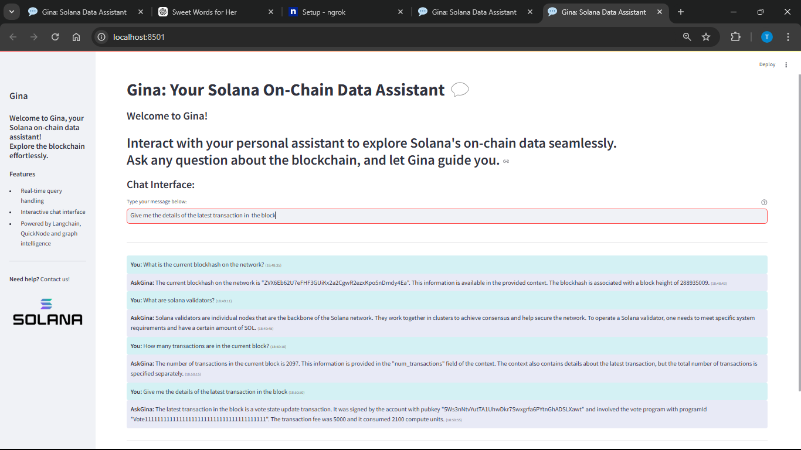

# Ask Gina Alt for Solana  
## AI-Powered In-Feed Assistant for On-Chain Data**  

## Overview  
Ask Gina Alt for Solana is an AI-powered in-feed assistant that streamlines access to on-chain data for the Solana blockchain. Positioned under the "Social and Chat Agents" category, it simplifies interaction with blockchain data, enhancing usability for technical and non-technical users.  

## Purpose  
The project aims to:  
- Simplify access to complex on-chain data.  
- Enhance user experience for the Solana community.  
- Support blockchain workflows with real-time insights.  

## Features  
- **AI-Powered Assistance**: Uses advanced machine learning models for accurate responses.  
- **Real-Time On-Chain Data**: Provides insights into block details, transactions, and key metrics.  
- **Seamless Integration**: Fully compatible with Solana's ecosystem for precise, context-aware interaction.  

## Use Cases  
- **Blockchain Analytics**: Retrieve insights on blocks, transactions, and other metrics.  
- **User Support**: Answer Solana-related queries in a conversational format.  
- **Development Aid**: Assist developers with technical data for Solana-based projects.  

## Setup Guide  

### 1. Create a Stream on QuickNode  
- Set up a stream on QuickNode and configure the destination to the webhook route in your Flask app.  

### 2. Host the Webhook  
- Use Flask to handle incoming POST requests.  
- Expose the webhook to the internet using tools like ngrok.  

### 3. Configure Webhook to Handle Data  
- Process incoming data using the Flask app and integrate it with Ask Gina's brain (compiled graph).  

### 4. Test the Workflow  
- Use Streamlit and the `test_app.py` script to validate that data is received and processed correctly.  
- Monitor the server during initial tests for any issues.  

## Results and Testing 
Here I validate the seamless flow of data from the QuickNode stream to the Flask app, ensuring that real-time on-chain data is processed and displayed correctly. Screenshots below capture the successful data reception and processing, confirming that the workflow is functioning as expected.

 

## Acknowledgments   
I would like to thank the following resources and tools that contributed to the success of this project:  

- **QuickNode** for enabling reliable blockchain streaming capabilities.  
- **Flask** for providing a simple yet powerful web framework.  
- **Streamlit** for its interactive interface used in testing and validation.  
- **Solana Ecosystem** for the robust blockchain network and data access.  
- **Bounty documentation** for guiding the integration of QuickNode with Flask.

